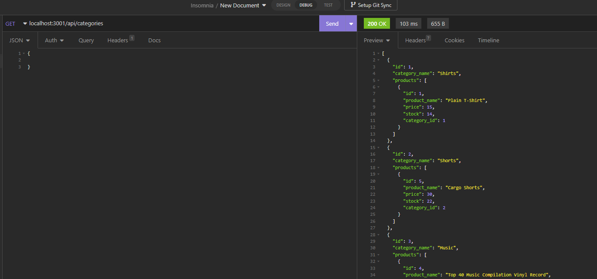
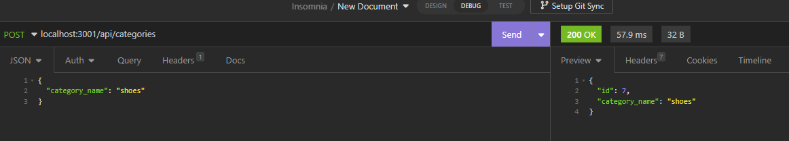

# Helpful_E-Commerce_Back_End_ORM

## Table-of-Contents

  * [Description](#description)
  * [Installation](#installation)
  * [Usage](#usage)
  * [License](#license)
  * [Contributing](#contributing)
  * [Links](#questions)
  
## [Description](#table-of-contents)
The challenge for this week is to build the back end for an e-commerce site by taking a working Express.js API and configure it to use Sequelize to interact with a MySQL database. 

## [Installation](#table-of-contents)
You can clone the code from the github repository and clone it on your computer. Open the file in VS Code. In the root directory of the project, type in the terminal command line 'npm i' to download the dependencies. Initiate the database with 'mysql -u root -p', then 'source db/schema.sql' to create the tables. Exit the mysql terminal. Run 'npm run seed' to seed the data into your tables. Type 'node .\server.js' to start your servcer. 

## [Usage](#table-of-contents)

  

  

  
## [license](#table-of-contents)
MIT License

## [Contributing](#table-of-contents)
Contributions will not be accepted at this time.

## [Links](#table-of-contents)

[GitHub](https://github.com/mikestem)

[Walk Through Video](https://drive.google.com/file/d/1Rk8etkSd-eBqxOq2UehmXH32yrI-zbts/view)

